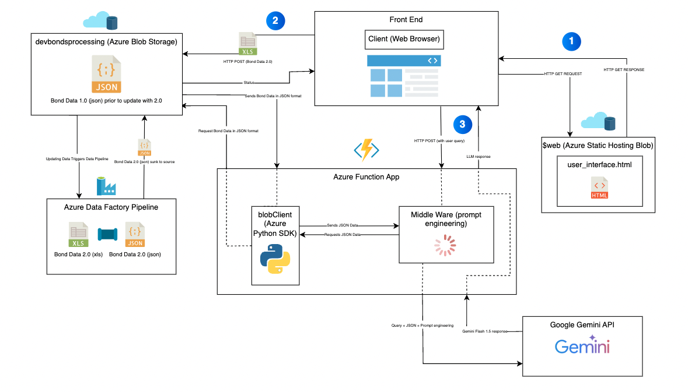

Built a bare bones web-app for the Commissioner of Finance to quickly query large excel sheets of City of Syracuse Bond data. I created the architectural diagram of the Azure system below using draw.io. 

(1) User enters URL and the Azure Blob Storage, with Static Hosting enabled, serves the HTML/CSS to the Client. 
(2) When new Bond Data is posted, a data pipeline is triggered and the Excel Sheets are converted to JSON data. This design decision leaves room for a vector database implementation in the future to increase accuracy and decrease latency. 
(3) The user input is submitted in the HTML form and an LLM response is retreived.

Full disclosure, this was an educational project and all data displayed is publicly accessible. 

Here's an example of how the middleware assesses confidence levels of Gemini's responses.

